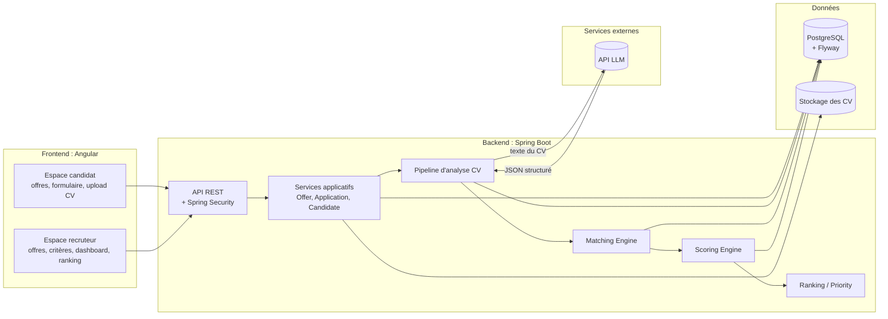
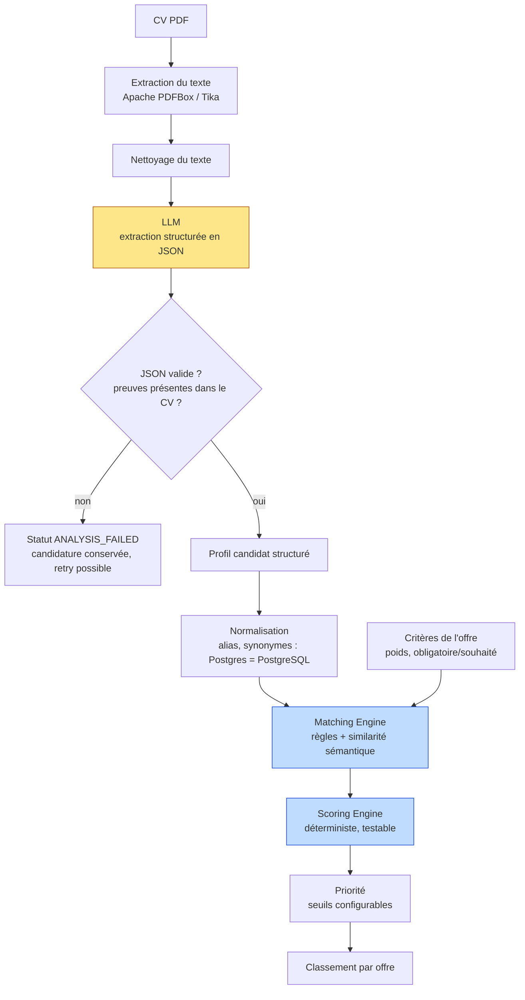
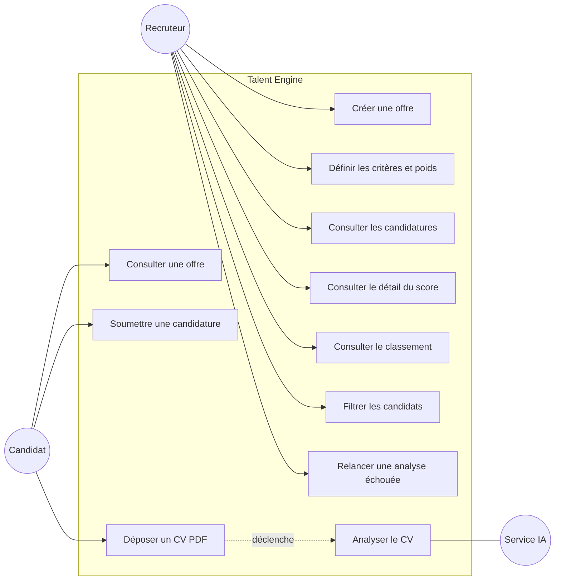
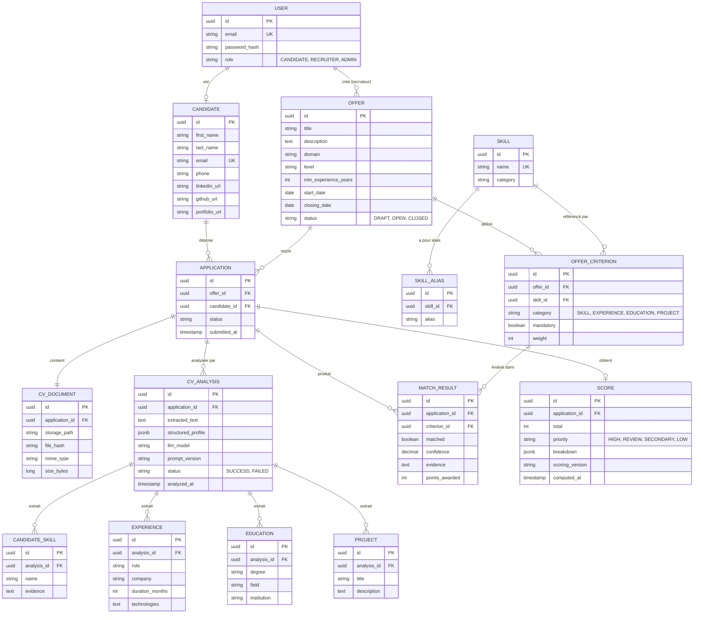
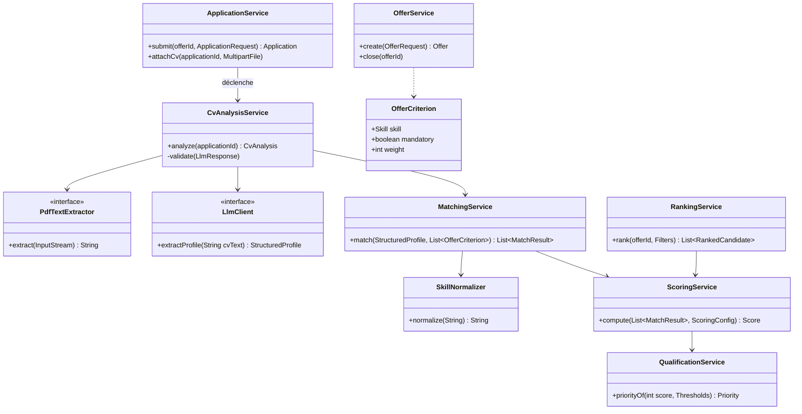
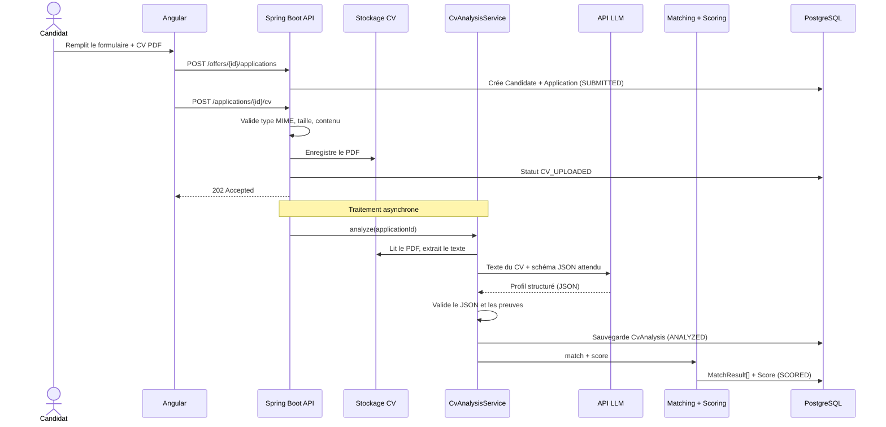
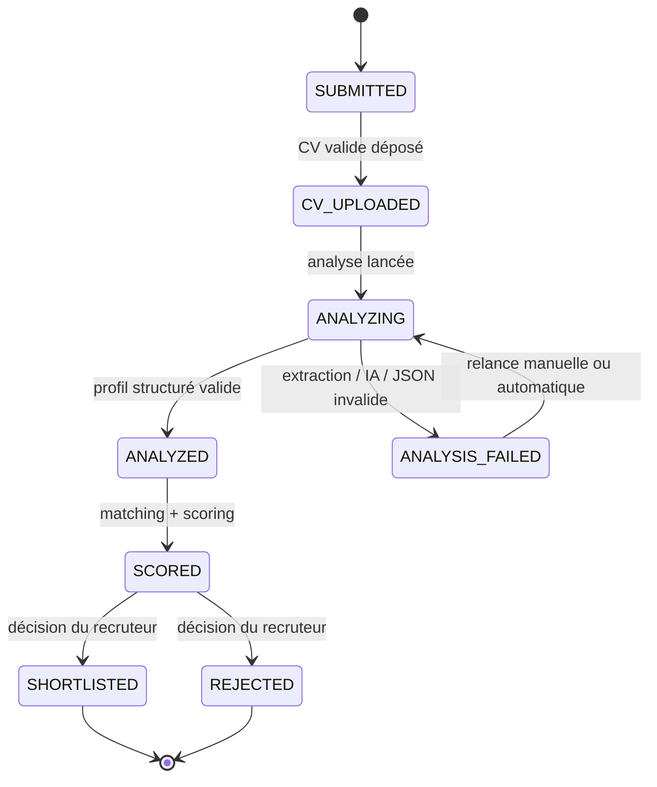

# Talent Engine : Architecture & UML

> **Principe central** : l'IA comprend les informations non structurées ; le moteur métier décide comment les comparer et les scorer.

Les diagrammes sont en [Mermaid](https://mermaid.js.org/) .

---

## 1. Vue d'ensemble de l'architecture



---

## 2. Séparation IA / moteur métier



> Le LLM n'intervient qu'à une seule étape (extraction). Le score est **calculé en Java**, il est donc reproductible et explicable.

---

## 3. Diagramme de cas d'utilisation



---

## 4. Modèle de données (ER)



---

## 5. Diagramme de classes (couche métier)



---

## 6. Séquence : de la candidature au score



---

## 7. Cycle de vie d'une candidature



---

## 8. Scoring et priorisation

Score sur 100, calculé par le backend :

| Catégorie              | Points |
|------------------------|-------:|
| Compétences obligatoires | 40   |
| Compétences souhaitées   | 20   |
| Expérience               | 20   |
| Formation                | 10   |
| Projets                  | 10   |

Formule par catégorie :

```
points_catégorie = max_catégorie × (Σ poids des critères satisfaits / Σ poids des critères de la catégorie)
score_final      = Σ points_catégorie
```

| Score    | Priorité                 |
|----------|--------------------------|
| 80 – 100 | Élevée                   |
| 60 – 79  | À examiner               |
| 40 – 59  | Secondaire               |
| 0 – 39   | Faible correspondance    |

Seuils et pondérations sont stockés en configuration (par offre ou globalement).

---

## 9. Structure du projet Spring Boot

```
src/main/java/org/example/skulvi_cv/
├── config/            # Security, OpenAPI, propriétés (seuils, LLM)
├── offer/             # controller, service, repository, dto, entity
├── candidate/
├── application/
├── cv/                # upload, stockage, extraction PDF
├── analysis/          # CvAnalysisService, LlmClient, prompts, validation
├── matching/          # MatchingService, SkillNormalizer
├── scoring/           # ScoringService, QualificationService
├── ranking/           # RankingService, filtres
├── dashboard/         # statistiques
└── common/            # exceptions, handler global, utilitaires
```

Organisation **par fonctionnalité** (et non par couche technique) : chaque package est cohérent et facilement testable.

---

## 10. Pistes d'amélioration du cahier des charges

**Cohérence**
- Les sections 6 et 10 décrivent deux grilles de poids différentes (critère par critère, puis par catégorie). Retenir une règle unique : les poids par critère s'agrègent par catégorie (voir formule section 8).
- Harmoniser le nom de l'organisation (`SKULLVI` / `Skulvi`).

**Robustesse**
- **Traitement asynchrone** de l'analyse (`@Async` ou file de tâches) : l'upload répond en `202` sans attendre le LLM.
- **Retry** avec backoff et statut `ANALYSIS_FAILED` explicite.
- **Idempotence** : hash du fichier pour détecter les doublons, contrainte unique `(candidate, offer)`.
- **Validation du JSON** du LLM (schéma strict, valeurs inconnues rejetées).

**Fiabilité de l'IA**
- Demander au LLM une **sortie JSON contrainte** avec, pour chaque compétence, l'extrait du CV qui la justifie (`evidence`).
- **Vérifier côté backend** que cet extrait existe réellement dans le texte du CV : cela limite les hallucinations.
- **Normalisation avant le LLM** : table `SKILL` + `SKILL_ALIAS` (Postgres = PostgreSQL) qui résout déjà une grande partie des cas sémantiques sans appel IA.
- Versionner le prompt (`prompt_version`) et le modèle utilisé dans `CV_ANALYSIS`.

**Scoring**
- Définir la règle des critères **obligatoires** : pénalisation, plafonnement du score, ou simple signalement ? À trancher et documenter.
- Stocker `scoring_version` et un snapshot du détail (`breakdown`) pour que le score reste explicable même si l'offre est modifiée ensuite.
- Gérer le cas « offre sans critères » (score non calculable, pas de division par zéro).

**Éthique et conformité**
- Ne **jamais** utiliser nom, âge, genre, photo ou nationalité dans le scoring : les exclure explicitement du prompt et du matching.
- Garder l'humain dans la boucle : statuts `SHORTLISTED` / `REJECTED` décidés par le recruteur uniquement.
- Prévoir suppression/anonymisation des données (RGPD) et durée de conservation des CV.

**Sécurité**
- Vérifier le type réel du fichier (signature PDF, pas seulement l'extension), limiter la taille, renommer les fichiers à l'enregistrement.
- Rate limiting sur l'endpoint de candidature publique.
- Ne jamais commiter la clé de l'API LLM (variable d'environnement).

**Qualité**
- Tests du moteur de scoring avec des **jeux de profils fixes** (golden tests) : même entrée, même score.
- Mock du `LlmClient` dans les tests d'intégration pour ne pas dépendre du réseau.
- Migrations **Flyway** dès le départ, `ddl-auto: validate` en production (au lieu de `update`).

**Priorisation du MVP**
1. Offre + critères + candidature + upload
2. Extraction PDF + appel LLM + profil structuré
3. Matching + scoring + explication
4. Ranking
5. Dashboard et filtres (en dernier, si le temps le permet)

# Skulvi CV

Application Spring Boot (Maven) avec PostgreSQL, lancée via Docker Compose.

## Prérequis

- Docker et Docker Compose
- (Optionnel) Java 21 et Maven pour lancer l'app hors Docker

## Configuration

Copier le fichier d'exemple puis renseigner les valeurs :

```bash
cp .env.example .env
```

**.env.example**
```env
DB_HOST=postgres
DB_PORT=5432
DB_NAME=mydb
DB_USER=myuser
DB_PASSWORD=changeme
DB_EXPOSED_PORT=5433
APP_PORT=8080
```

| Variable          | Rôle                                                              |
|-------------------|-------------------------------------------------------------------|
| `DB_HOST`         | Nom du service Postgres dans le compose (`postgres`)              |
| `DB_PORT`         | Port interne de Postgres (reste `5432`)                           |
| `DB_NAME`         | Nom de la base                                                    |
| `DB_USER`         | Utilisateur de la base                                            |
| `DB_PASSWORD`     | Mot de passe de la base                                           |
| `DB_EXPOSED_PORT` | Port exposé sur la machine hôte (DBeaver, pgAdmin...)             |
| `APP_PORT`        | Port exposé de l'application                                      |

> Le fichier `.env` ne doit **jamais** être commité (il est dans `.gitignore`).

## Lancer le projet

```bash
docker compose up --build
```

- Application : http://localhost:8080 (ou la valeur de `APP_PORT`)
- PostgreSQL depuis l'hôte : `localhost:<DB_EXPOSED_PORT>`

Arrêter :
```bash
docker compose down
```

Arrêter et supprimer les données de la base :
```bash
docker compose down -v
```

## Fonctionnement

- `application.yml` lit la connexion à la base via les variables d'environnement.
- `docker-compose.yml` démarre Postgres avec un healthcheck : l'app ne démarre qu'une fois la base prête.
- Le `Dockerfile` est multi-stage : build avec Maven, exécution avec un JRE léger.

## Dépannage

**`port is already allocated` / `address already in use`**
Un autre service utilise déjà le port. Changer `DB_EXPOSED_PORT` ou `APP_PORT` dans `.env`.
Pour identifier ce qui occupe un port : `sudo lsof -i :5432`

**`TLS handshake timeout` lors du pull des images**
Problème réseau vers Docker Hub. Configurer des DNS publics dans `/etc/docker/daemon.json` :
```json
{ "dns": ["8.8.8.8", "1.1.1.1"] }
```
puis `sudo systemctl restart docker`.

**La configuration datasource n'est pas prise en compte**
Vérifier que `datasource` et `jpa` sont directement sous `spring:` dans `application.yml` (pas de `spring:` imbriqué).

## Structure

```
.
├── Dockerfile
├── docker-compose.yml
├── .env.example
├── pom.xml
└── src/
```
## Notes de développement
Commandes utiles, problèmes résolus et aide-mémoire : voir [DEV-NOTES.md](DEV-NOTES.md).

